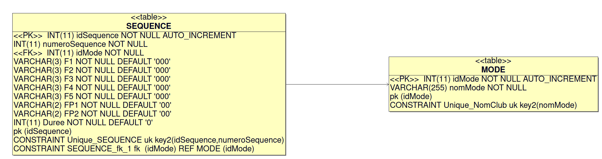
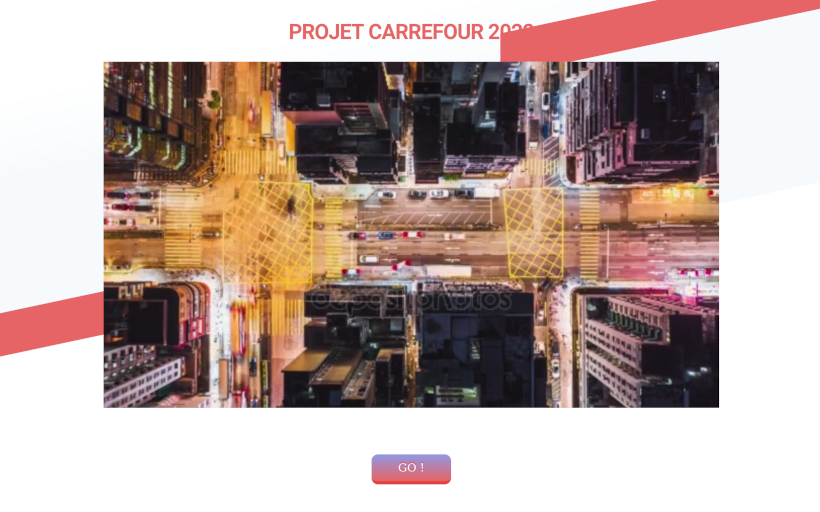
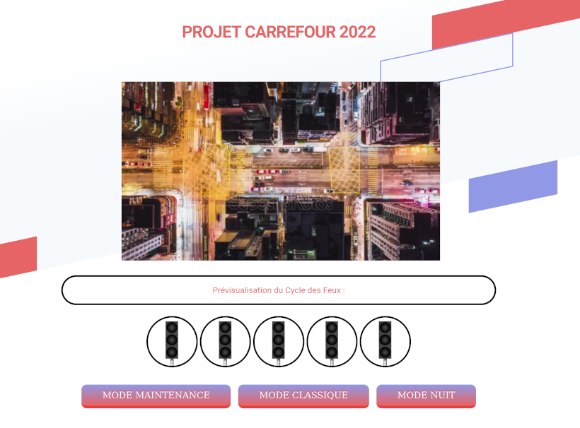
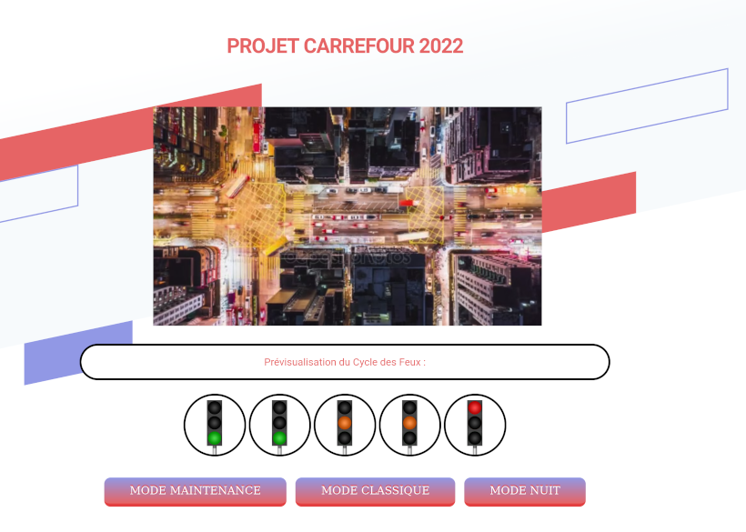

# Mini-projet Feux de carrefour 2022

- [Mini-projet Feux de carrefour 2022](#mini-projet-feux-de-carrefour-2022)
  - [Présentation](#présentation)
  - [Objectifs IR](#objectifs-ir)
  - [Base de données](#base-de-données)
  - [Captures d'écran](#captures-décran)
  - [Auteur](#auteur)

## Présentation

Il s’agit de piloter un ensemble de feux de carrefour (maquette) via une application web en disposant de plusieurs stratégies de fonctionnement.

Les différents feux sont :

- feux tricolores dont 4 indépendants sur la voie principale et 2 en parallèle sur la voie secondaire.
- 4 feux bicolores piétons

La stratégie de circulation au carrefour doit permettre d'élaborer les différentes commandes pour ces feux.

Exemple de stratégie :

- Carrefour en panne ou en maintenance : Feux clignotants orange sur les 2 voies (pas de prise en compte des capteurs).
- Fonctionnement Classique : Feux vert voie principale et feux pour tourner à gauche clignotants orange, feux rouge voie secondaire en alternance par une temporisation (pas de prise en compte des capteurs).
- Fonctionnement automatique : La voie principale est prioritaire mais l'information provenant de tous les capteurs est prise en compte(appels piétons et détections véhicule) après une temporisation, pour éviter les changements de cycle trop fréquents.

## Objectifs IR

Il s'agit de réaliser une application logicielle web afin d'interagir avec un système numérique réalisé conjointement par des étudiants IR et EC.

Les fonctionnalités demandées sont :

- communiquer via une liaison série avec le système embarqué réalisé par l'étudiant EC afin de :
    - récupérer des données en provenance du module électronique
    - envoyer des commandes et/ou paramètres de configuration au module électronique
- produire une IHM web afin :
    - d'afficher des données en provenance du module électronique
    - de commander et/ou paramétrer le module électronique
    - stocker des données et/ou des paramètres de configuration dans une base de données

## Base de données

La base de données `FEUX` est structurée autour de deux tables :

- `MODE` contient les différents modes de fonctionnement du carrefour
- `SEQUENCE` définit les séquences de commandes de feux



```sql
--- LDD (langage de définition de données)

--
-- Base de données: `FEUX`
--

--- Supprime la base de données

DROP DATABASE IF EXISTS `FEUX`;

--- Crée la base de données

CREATE DATABASE IF NOT EXISTS `FEUX`;

--- Sélectionne la base de données

USE `FEUX`;

--- Supprime les tables

DROP TABLE IF EXISTS MODE;
DROP TABLE IF EXISTS SEQUENCE;

--- Crée la table MODE

CREATE TABLE IF NOT EXISTS `MODE` (
  `idMode` int(11) NOT NULL AUTO_INCREMENT,
  `nomMode` varchar(255) NOT NULL,
  PRIMARY KEY (`idMode`),
  CONSTRAINT Unique_NomClub UNIQUE (`nomMode`)
) ENGINE=InnoDB DEFAULT CHARSET=utf8;

--- Crée la table MODE

CREATE TABLE IF NOT EXISTS `SEQUENCE` (
  `idSequence` int(11) NOT NULL AUTO_INCREMENT,
  `numeroSequence` int(11) NOT NULL,
  `idMode` int(11) NOT NULL,
  `F1` VARCHAR(3) NOT NULL DEFAULT '000', `F2` VARCHAR(3) NOT NULL DEFAULT '000', `F3` VARCHAR(3) NOT NULL DEFAULT '000', `F4` VARCHAR(3) NOT NULL DEFAULT '000', `F5` VARCHAR(3) NOT NULL DEFAULT '000', `FP1` VARCHAR(2) NOT NULL DEFAULT '00', `FP2` VARCHAR(2) NOT NULL DEFAULT '00', `Duree` INT(11) NOT NULL DEFAULT 0,
  PRIMARY KEY (`idSequence`),
  CONSTRAINT Unique_SEQUENCE UNIQUE (`idSequence`,`numeroSequence`),
  CONSTRAINT SEQUENCE_fk_1 FOREIGN KEY (`idMode`) REFERENCES MODE(`idMode`) ON DELETE CASCADE
) ENGINE=InnoDB DEFAULT CHARSET=utf8;

--- LMD (langage de manipulation de données)

--- Table MODE

INSERT INTO MODE (idMode, nomMode) VALUES (NULL,'CLASSIQUE');
INSERT INTO MODE (idMode, nomMode) VALUES (NULL,'MAINTENANCE');

--- Table SEQUENCE

--- Mode MAINTENANCE

INSERT INTO `SEQUENCE` (`numeroSequence`, `idMode`, `F1`, `F2`, `F3`, `F4`, `F5`, `FP1`, `FP2`, `Duree`) VALUES ('1', '2', '010', '010', '010', '010', '010', '00', '00', 2), ('2', '2', '000', '000', '000', '000', '000', '00', '00', 2);

--- Mode CLASSIQUE

INSERT INTO `SEQUENCE` (`numeroSequence`, `idMode`, `F1`, `F2`, `F3`, `F4`, `F5`, `FP1`, `FP2`, `Duree`) VALUES ('1', '1', '100', '100', '010', '010', '001', '00', '00', 3), ('2', '1', '100', '100', '000', '000', '100', '00', '00', 4);
```

Exemples de requêtes SQL :

- Liste des modes :

```sql
SELECT * FROM MODE;
```

|idMode|nomMode    |
|------|-----------|
|1     |CLASSIQUE  |
|2     |MAINTENANCE|

- Liste des séquences pour un mode (ici CLASSIQUE) :

```sql
SELECT * FROM SEQUENCE INNER JOIN MODE ON MODE.idMode = SEQUENCE.idMode WHERE SEQUENCE.idMode = 1 ORDER BY SEQUENCE.numeroSequence ASC;

--- ou avec le nom du MODE :

SELECT * FROM SEQUENCE INNER JOIN MODE ON MODE.idMode = SEQUENCE.idMode WHERE MODE.nomMode = 'CLASSIQUE' ORDER BY SEQUENCE.numeroSequence ASC;
```

|idSequence|numeroSequence|idMode|F1 |F2 |F3 |F4 |F5 |FP1|FP2|Duree|idMode|nomMode  |
|----------|--------------|------|---|---|---|---|---|---|---|-----|------|---------|
|3         |1             |1     |100|100|010|010|001|00 |00 |3    |1     |CLASSIQUE|
|4         |2             |1     |100|100|000|000|100|00 |00 |4    |1     |CLASSIQUE|


## Captures d'écran







## Auteur

- [Célian SUBIRANA](https://github.com/csubirana)

